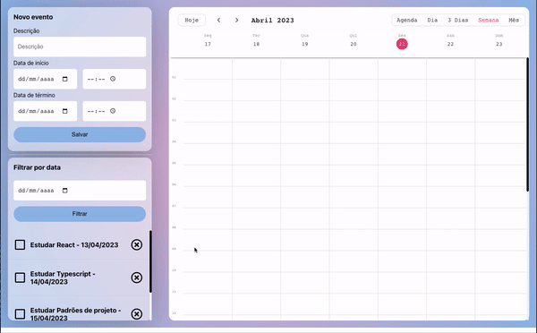

<h1 align="center">Alura Event Tracker</h1>

<div align="center">
    
</div>

## 📚 Sobre
O projeto consiste em um calendário para eventos. Possui as funcionalidades de adicionar, editar e excluir eventos, como também fazer a busca do evento por dia no calendário.

O principal objetivo foi fazer a refatoração deste projeto, removendo o encapsulamento do Recoil e as dependências de props nos componentes, deixando-o mais escalável para futuras implementações.

## 🚀 Tecnologias Utilizadas
- ReactJs
- Recoil
- Sass
- Css modules
- Typescript

## ⏱️ Iniciar projeto

```bash
# Clone o repositório:
https://github.com/polyanetuag/event-tracker.git

# Instale as dependências
$ yarn install

# Execute o servidor de desenvolvimento:
$ yarn start

```

## 📋 Licença
Esse projeto está sob a licença MIT. 

---

Desenvolvido com 💜 por Polyane Tuag
